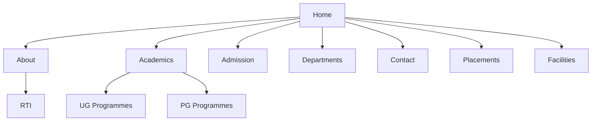
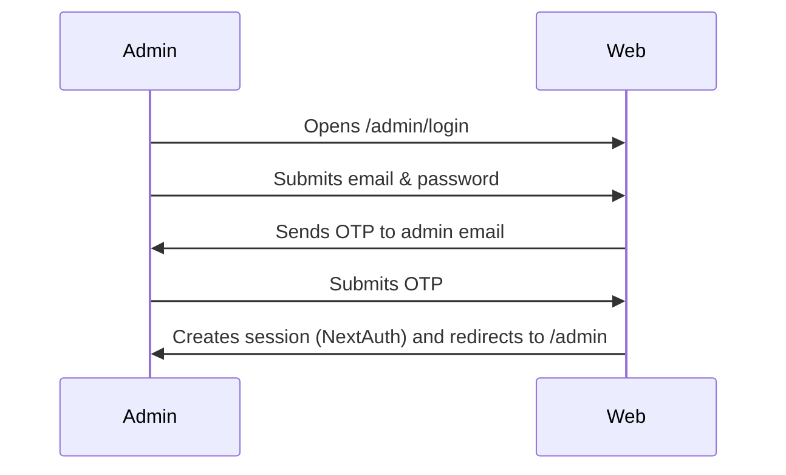

# K.M.M. College Website — User Manual

Version: 1.0

---

Revision history

- 1.0 (2026-06-09) — Initial full documentation draft generated from source code analysis.

Table of Contents

1. Introduction
2. System Overview
3. Navigation Guide
4. User Roles & Permissions
5. Features (complete)
6. Page-by-Page Documentation
7. Workflows and User Journeys
8. Forms and Validation
9. APIs and Integrations
10. Data Models (summary)
11. Error Handling
12. FAQ
13. Troubleshooting
14. Appendix

---

## 1. Introduction

This manual describes the public-facing website and admin CMS for K.M.M. College, Kumbalam. It explains pages, features, navigation, forms, admin workflows, validations, and common troubleshooting steps in plain language for non-technical users.

Audience: prospective students, parents, college staff, and site administrators.

## 2. System Overview

What the website does

- Presents college information: programmes, departments, facilities, admission details, placements, academic calendar, and news/updates.
- Provides public contact and enquiry form for visitors.
- Includes an admin CMS for authorised staff to update site content (carousel, programmes, placements, PDFs, images, facility lists, about page messages, etc.).
- Supports simple file uploads (images and PDFs) via Cloudinary, and sending emails for enquiries and bug reports.

How it's structured

- Frontend: Next.js app with pages under `app/` and reusable UI in `components/`.
- Backend: Server routes under `app/api/` implementing JSON endpoints for data and file upload functionality.
- Data: MongoDB models live in `models/` and site content is read/written via helpers in `lib/`.
- Admin: Protected `/admin` pages with server-side form handlers and file upload endpoints.

## 3. Navigation Guide

Site top-level navigation (as users see it):

Home
├─ About Us
│  ├─ Introduction
│  ├─ Vision
│  ├─ Messages
│  ├─ Code of Conduct
│  └─ RTI
├─ Academics
│  ├─ UG Programmes
│  ├─ PG Programmes
│  └─ Academic Calendar
├─ Departments
├─ Co-Curricular
├─ Placements
├─ Add On Courses
├─ Facilities
└─ Contact

Quick links & additional menus appear in the header and footer (social links, admission contact, PDF resources).

## 4. User Roles & Permissions

- Guest / Visitor: Browse all public pages, view programmes and placements, use the contact/enquiry form, and view documents.
- Admin: Access `/admin` area after authenticating. Can edit site content (carousel, pages, placements, programmes), upload images/PDFs, save site settings, delete unused assets, and trigger server revalidation.

Notes:
- Only an assigned admin email (ADMIN_EMAIL environment variable) is permitted for password-based login + OTP flows.
- Admin login supports OAuth via GitHub when configured.

## 5. Features (Complete)

- Home carousel with up to configured slides.
- Homepage programme cards for UG and PG.
- Latest updates module.
- About page with leadership messages and RTI content.
- Academics page listing UG/PG programmes, documents required, and academic calendar PDF.
- Departments page with department sections and faculty listings.
- Facilities page with hero content and cards for different facilities.
- Placements page showing placed students cards.
- Add-on courses page with grouped course lists.
- Contact page with contact settings and enquiry form (sends email to college contact addresses).
- Admin dashboard with multiple panels: carousel, latest updates, programme cards, facilities, placements, departments, add-on courses, about messages, NSS officers, PG/UG programme editors, image and PDF upload fields, site settings editor.
- File upload endpoints and helpers for images and PDFs (with size and type validation).
- Bug report endpoint (rate-limited) that sends reports to developers.
- Search API returning predefined and dynamic results.

## 6. Page-by-Page Documentation

Use the following template for each page. Below are entries for the implemented pages.

---

# Home Page

## Purpose
Introduce visitors to the college — hero carousel, programme highlights (UG/PG cards), latest updates, and quick contact.

## How to Access
Open the site root: `/` (home page).

## Page Overview
Sections: hero carousel, campus highlights, programme cards, latest updates, footer.

## Screenshot
[PLACEHOLDER] — Capture `http://localhost:3000/` when running the site. See "Screenshot instructions" below.

## Available Actions
- Click carousel slide links to programme sections.
- Click programme cards to open detailed academics section.
- Open latest updates items.
- Use header nav to move to other pages.

## Step-by-Step Instructions
1. From home, click "Academics" to view programme details. 
2. Click a programme card to jump to the academics page details.

## Notes
- Carousel images and slide text are managed in the admin panel (Home Carousel).

## Troubleshooting
- If images fail to load, the admin may need to re-upload images via the admin uploads panel.

---

# About Page

## Purpose
Explain college mission, leadership messages and statutory disclosures (RTI link available).

## How to Access
Header → About Us → Introduction (or `/about`).

## Page Overview
Header, hero image, leadership messages, code of conduct and RTI links.

## Screenshot
[PLACEHOLDER] — Capture `/about`.

## Available Actions
- View messages and staff quotes.
- Navigate to RTI information at `/about/rti`.

## Step-by-Step Instructions
1. From header, open About → Messages.
2. Read leadership quotes and contact details.

## Notes
- Messages are editable in Admin → About Messages.

## Troubleshooting
- If a message is missing, the admin may have deleted it. Check admin About Messages panel.

---

# RTI Page

## Purpose
Shows Right to Information statutory information and contact details for public information officers.

## How to Access
Header → About Us → RTI (`/about/rti`).

## Page Overview
Static content blocks with institution details, officers, highlights and statutory declaration.

## Screenshot
[PLACEHOLDER] — Capture `/about/rti`.

## Available Actions
- None interactive — content is for reading. Contact details are provided.

## Step-by-Step Instructions
- Read officer listings and the statutory declaration.

## Notes
- Content is authored within static page code (`/app/about/rti/page.jsx`) and not from admin panels.

---

# Academics Page

## Purpose
Lists UG and PG programmes, documents required, syllabus links, and academic calendar.

## How to Access
Header → Academics (`/academics`).

## Page Overview
UG programme section, PG programme section, documents required, academic calendar PDF link.

## Screenshot
[PLACEHOLDER] — Capture `/academics`.

## Available Actions
- Click programme anchors to jump to specific programme details.
- Download academic calendar PDF if uploaded.

## Step-by-Step Instructions
1. From Academics, choose UG or PG programme sections.
2. For details, click the programme anchor or see the syllabus PDF links.

## Notes
- UG and PG programme data is managed via Admin → UG Programmes / PG Programmes.
- Academic calendar management is in Admin → Academic Calendar.

---

# Departments Page

## Purpose
Show department list, descriptions and faculty.

## How to Access
Header → Departments (`/departments`).

## Page Overview
Department sections (Commerce, Computer Application, Psychology, Business Administration, Mathematics, Languages).

## Screenshot
[PLACEHOLDER] — Capture `/departments`.

## Available Actions
- Click department links in header/footer to jump to department sections.

## Step-by-Step Instructions
- Use department anchors to read details and faculty listings.

## Notes
- Department data is read from `lib/departments.js` defaults by code.

---

# Facilities Page

## Purpose
Show campus facilities and contact call-to-action.

## How to Access
Header → Facilities (`/facilities`).

## Page Overview
Hero image, facilities grid, CTA to contact page.

## Screenshot
[PLACEHOLDER] — Capture `/facilities`.

## Available Actions
- Click "Contact the College" button to open `/contact`.

## Step-by-Step Instructions
- Review facility cards and read descriptions.

## Notes
- Facilities content is editable via Admin → Facilities panel.

---

# Admissions Page

## Purpose
Provide admission overview, contact for admissions and programme seat counts.

## How to Access
Header → Admission (`/admission`).

## Page Overview
Hero call-to-action to call admissions, enquiry link, programme summary.

## Screenshot
[PLACEHOLDER] — Capture `/admission`.

## Available Actions
- Click "Call Admissions Desk" to dial the admission phone number from supported devices.
- Click "Enquiry Form" to open contact section.

## Step-by-Step Instructions
1. Click "Enquiry Form" to send an enquiry via contact page.
2. Or call the admissions phone number directly.

## Notes
- Admission phone shown is derived from site settings; update in Admin → Contact & Social.

---

# Contact Page

## Purpose
Display college contact details and provide an enquiry form for public submissions.

## How to Access
Header → Contact (`/contact`).

## Page Overview
Contact cards, map/location, enquiry form.

## Screenshot
[PLACEHOLDER] — Capture `/contact`.

## Available Actions
- Fill and submit the enquiry form (name, email, type, message). This sends email to configured contacts.

## Step-by-Step Instructions
1. Fill your name, email and select enquiry type.
2. Write your message and submit.
3. Expect an acknowledgement when the form is processed (email sent server-side).

## Notes
- The enquiry endpoint validates email and message length. See Forms section for validations.

---

# Placements Page

## Purpose
Show recent placed students and placement highlights.

## How to Access
Header → Placements (`/placements`).

## Page Overview
Grid of placed student cards (image + title) and placement notes.

## Screenshot
[PLACEHOLDER] — Capture `/placements`.

## Available Actions
- None (viewer). Admin can edit placed student cards in Admin → Placed Students.

---

# Add-On Courses Page

## Purpose
List short add-on programmes available to students.

## How to Access
Header → Add On Courses (`/add-on-courses`).

## Page Overview
Hero content and groups of add-on courses.

## Screenshot
[PLACEHOLDER] — Capture `/add-on-courses`.

## Available Actions
- None for visitors. Admin can add groups in Admin panel.

---

# Admin Dashboard (/admin)

## Purpose
A Content Management System (CMS) to update site content.

## How to Access
Open `/admin`. You will be redirected to `/admin/login` if unauthenticated.

## Page Overview
Admin layout contains a sidebar of CMS sections and an editing area with forms for each content panel:
- Home Carousel
- Latest Updates
- Home Programme Cards
- Campus Image / college campus image
- Contact & Social
- About Messages
- Add-On Courses
- Facilities
- Campus Sections
- UG Programmes
- PG Programmes
- Placed Students
- Departments
- NSS Programme Officers
- Academic Calendar

## Screenshot
[PLACEHOLDER] — Capture `/admin` after login.

## Available Actions
- Edit text fields, lists, and file paths.
- Upload images and PDFs using provided upload controls.
- Tick Delete checkboxes to remove entries.
- Click Save (sticky button) to persist changes.

## Step-by-Step Admin Tasks
1. Login: `/admin/login` (email/password + OTP) or GitHub (if configured).
2. Select a CMS section from the left navigation.
3. Edit fields or add rows using the blank row at the end of lists.
4. Upload images or PDFs when needed (image: max 5 MB; PDF: max 20 MB).
5. Click "Save changes" to persist and revalidate relevant site pages.

## Notes
- Image uploads use Cloudinary. Environment variables must be set for Cloudinary.
- File deletion attempts to remove unused Cloudinary assets.

---

## 7. Workflows and User Journeys

Navigation map (mermaid)



Major user journeys

Visitor → View Programme → Contact Admissions

1. Visitor opens Home → clicks programme card → navigates to Academics → clicks Enquiry → lands on Contact → fills enquiry form → submits.

Admin content update (example: update carousel)

1. Admin login → Admin dashboard → Home Carousel panel → edit slide fields or upload new image → Save changes → site revalidates home page and publishes new carousel.

Login process



File upload workflow

1. Admin picks a file via the upload control.
2. Client-side validation checks file type and size.
3. File is sent to `/api/upload` or `/api/pdf-upload`.
4. Server validates file again and uploads to Cloudinary.
5. Response contains `imageUrl` or `pdfUrl` used in the form and persisted on save.

## 8. Forms and Validation

Enquiry form (`/app/api/enquiry/route.js`)

- Fields: `name` (string), `email` (valid email), `type` (predefined types), `subject`, `message` (max length). 
- Validation: Email format validated server-side; message trimmed and max length enforced; types restricted to allowed list.
- Example input:
  - name: "Anita Rao"
  - email: "anita@example.com"
  - type: "Admissions"
  - message: "I would like to know the application deadline."
- Possible errors: invalid email, missing name, message too long.

Admin Login and OTP

- Login endpoint `/api/admin/login` expects `email` and `password`.
- Only `ADMIN_EMAIL` allowed for password login.
- On password verify, server generates OTP, saves hashed OTP to the user record, and emails OTP via configured mailer.
- `/api/admin/verify-otp` expects `email` and six-digit `otp`.
- After successful OTP verification, a login session is created via NextAuth credential provider.
- Error cases: invalid credentials, expired OTP, too many attempts.

Image upload (`/api/upload`)

- Allowed types: JPEG, PNG, WebP, AVIF.
- Max size: 5 MB.
- Auth: requires admin session.
- Response: `imageUrl`, `publicId`, and metadata.

PDF upload (`/api/pdf-upload`)

- Allowed types: PDF only.
- Max size: 20 MB.
- Folders restricted to allowed set (academic-calendar or pdfs).
- Auth: requires admin session.

Admin form patterns

- Many admin lists use row-count hidden inputs (e.g., `placed-row-count`) and index-based field names (`placed-0-title`, `placed-0-image`).
- Add new row by filling blank row appended by the UI.
- Delete by checking `...-delete` checkbox.

## 9. APIs and Integrations

Public/Client endpoints (HTTP GET):

- `/api/carousel` — returns carousel slides
- `/api/latest-updates` — latest updates list
- `/api/home-programme-cards` — UG/PG cards for homepage
- `/api/campus-sections` — campus overview sections
- `/api/departments` — departments JSON
- `/api/pg-programmes` — PG programmes and table rows
- `/api/ug-programmes` — UG programmes and table rows
- `/api/search` — site search (mix of static and dynamic results)
- `/api/site-settings` — site-wide settings
- `/api/placed-students` — placed students list

Protected endpoints (require admin auth):

- `/api/upload` — image upload (POST)
- `/api/pdf-upload` — PDF upload (POST/DELETE)
- `/api/admin/login` — credential login (POST)
- `/api/admin/verify-otp` — OTP verification (POST)
- `/api/report-bug` — public bug reports (rate limited)
- `/api/enquiry` — public enquiry email (POST)

Third-party integrations

- Cloudinary for images and PDFs (optional, configured via env variables).
- Gmail SMTP or nodemailer for enquiry emails (requires GMAIL_USER and GMAIL_APP_PASS).
- Resend for developer bug report emails (optional).

## 10. Data Models (summary)

Key MongoDB models are used to store site content. Each is a single-document collection keyed by `key`.

- SiteSettings — central settings (contact, social, images, route content)
- Carousel — `slides` array for homepage carousel
- AboutMessages — leadership messages
- HomeProgrammeCards — `ugCards` and `pgCards`
- LatestUpdates — `updates` array
- FacilitiesPage — `hero` and `items`
- AddOnCourses — `hero` and `groups`
- UgProgramme, PgProgramme — programme lists, syllabus rows, documentsRequired
- Placement — placed students
- NssProgrammeOfficers — officers array

Note: Model schemas are permissive (`strict: false`) to allow flexible content fields.

## 11. Error Handling

Common errors and user-facing messages

- Enquiry: "Invalid email" — user should provide a correctly formatted email address.
- Upload: "Only JPEG, PNG, WebP, and AVIF images are allowed." — ensure correct file type and size.
- Upload PDF: "Only PDF files are allowed." — ensure correct file type and size.
- Admin auth: "Invalid email or password." or "Invalid or expired verification code." — check credentials and OTP.
- Rate limit: Bug report endpoint may return 429 if too many reports from same IP.
- 404 Not Found: Custom not-found page guides back to home and useful links.

## 12. FAQ

Q: How do I reset my admin password?
A: Password management is not exposed via the UI. Admin account is expected to be managed directly in the database or via a separate admin user setup process.

Q: How do I update the homepage carousel images?
A: Login to `/admin`, open Home Carousel panel, replace slide `image` using the Image upload control, then Save.

Q: Why can't I upload images?
A: Check file type and size (max 5 MB). Ensure Cloudinary environment variables are configured.

Q: How do I publish an academic calendar PDF?
A: Admin → PG/UG or Academic Calendar → Upload PDF in the PDF upload control, Save changes.

Q: Where are contact form submissions sent?
A: They are emailed to addresses configured in site settings (admin contact emails configured in environment or site settings in admin).

## 13. Troubleshooting

Problem: Enquiry emails not received
Possible cause: SMTP/GMAIL credentials missing or incorrect.
Solution: Set `GMAIL_USER` and `GMAIL_APP_PASS` environment variables and restart the site.

Problem: Image uploads failing (server error)
Possible cause: Cloudinary is not configured correctly.
Solution: Ensure `CLOUDINARY_CLOUD_NAME`, `CLOUDINARY_API_KEY`, and `CLOUDINARY_API_SECRET` are set.

Problem: Admin login OTP not received
Possible cause: Mailer not configured or email blocked.
Solution: Check `ADMIN_EMAIL` value and email sending service (Resend or nodemailer) configuration.

Problem: Pages showing old content after admin save
Possible cause: ISR/caching. The admin saves call `revalidatePath` for affected pages but hosting may cache CDN layer.
Solution: Verify hosting cache and trigger a manual re-build if necessary.

## 14. Appendix

Screenshot instructions (how to capture required screenshots):

1. Run the site locally:

```bash
npm install
npm run dev
# or
pnpm install
pnpm dev
```

2. Visit pages to capture (using a browser at `http://localhost:3000/`):
- Home `/`
- Login `/admin/login`
- Admin Dashboard `/admin` (after login)
- Each public page: `/about`, `/about/rti`, `/academics`, `/admission`, `/contact`, `/facilities`, `/placements`, `/departments`, `/add-on-courses`.

3. For each screenshot, save with filename indicating page (e.g., `screenshot-home.png`) and include the caption and short explanation in the manual. Replace the [PLACEHOLDER] screenshot blocks with these images.

Developer file map (useful references)

- app/: Next.js pages and server components
- components/: Reusable UI components and admin panels
- app/api/: Server endpoints
- lib/: Data helpers and business logic
- models/: Mongoose schemas

Coverage review

- Inventory created from code analysis covers the pages, admin panels, APIs, and models shipped in the repository.
- Runtime behavior such as email delivery & cloud storage depend on environment variables and cannot be fully validated here.

Undocumented items to verify manually (notes):
- Any external OAuth provider configuration (GitHub) needs confirming in your environment.
- Live SMTP and Cloudinary credentials are required to test email and file uploads.

---

If you want, I can:
- Replace screenshot placeholders by launching the site locally here (I'll install dependencies and run the dev server), then capture screenshots.
- Generate a printer-ready PDF from this Markdown.
- Split this manual into separate files per section.

Which of these next steps would you like me to take?